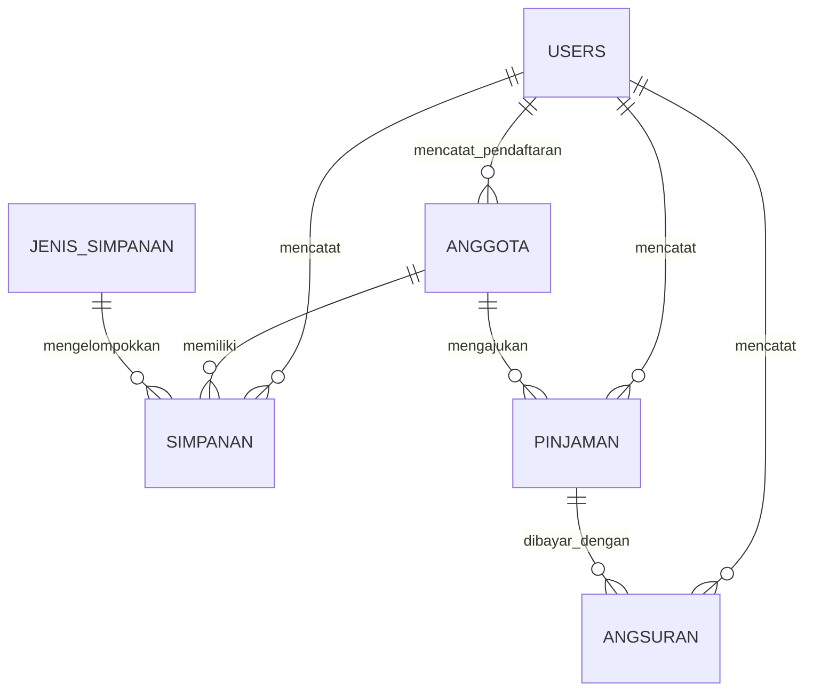
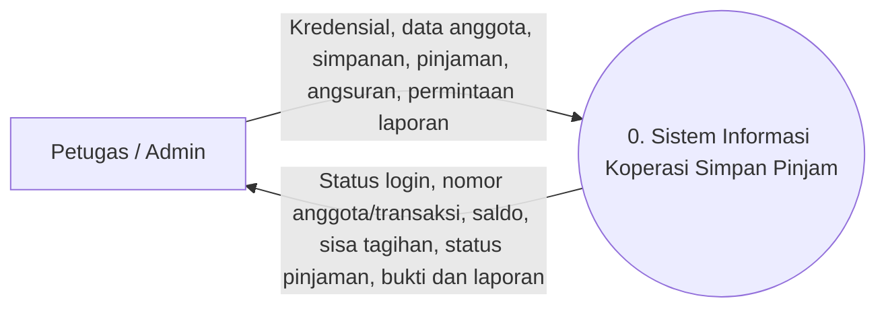

# Sumber Diagram Mermaid

## ERD

```mermaid
erDiagram
    USERS ||--o{ ANGGOTA : mencatat_pendaftaran
    USERS ||--o{ SIMPANAN : mencatat
    USERS ||--o{ PINJAMAN : mencatat
    USERS ||--o{ ANGSURAN : mencatat
    ANGGOTA ||--o{ SIMPANAN : memiliki
    ANGGOTA ||--o{ PINJAMAN : mengajukan
    JENIS_SIMPANAN ||--o{ SIMPANAN : mengelompokkan
    PINJAMAN ||--o{ ANGSURAN : dibayar_dengan
```

## DFD Level 0

```mermaid
flowchart LR
    A[Petugas / Admin] -->|Kredensial, data anggota, simpanan, pinjaman, angsuran, permintaan laporan| S((0. Sistem Informasi Koperasi Simpan Pinjam))
    S -->|Status login, nomor anggota/transaksi, saldo, sisa tagihan, status pinjaman, bukti dan laporan| A
```
